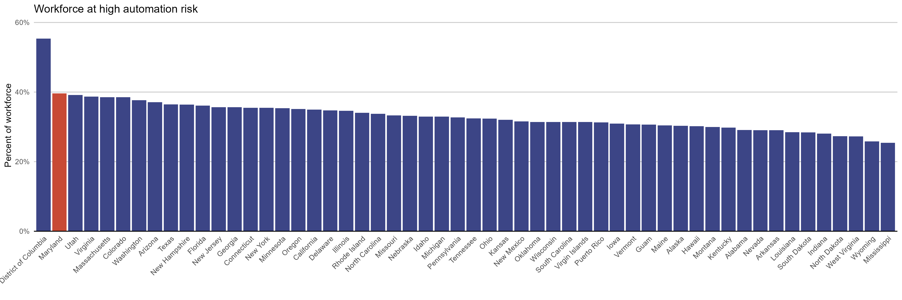
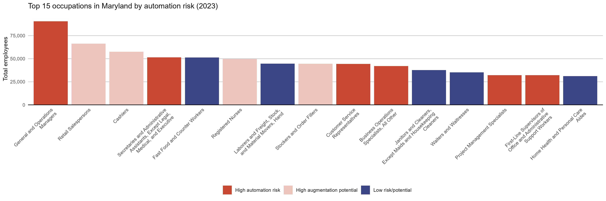
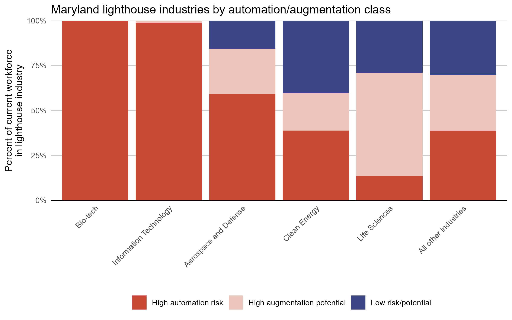

# Maryland Workforce AI Impact Analysis
A preliminary investigation into how AI might affect Maryland's workforce along BLS occupation codes

## Methodology

First, occupation titles and the total employment in that occupation per state for 2023 were downloaded from the [BLS May 2023 State Occupational Employment and Wage Estimates](https://www.bls.gov/oes/current/oes_md.htm).

Second, a system prompt was designed in order to disaggregate each occupation into a list of associated daily tasks. For each occupation, an LLM was tasked with enumerating each of those tasks. The enumation system prompt is as follows:

```
For the cross-industry occupation title given by the user, please enumerate a full list of reasonable tasks that a person in that occupation would need to perform on a daily basis. Consider the entire spectrum of that individual's duties and responsibilities, both online (if applicable) and in person, in formulating the tasks. Please respond only with valid JSON in the specified format.
```

Lastly, a system prompt was designed in order to rate each occupation and task by the ability for an AI to complete it. It was important in the prompt to emphasize the legal, physical, and emotional requirements of each task, otherwise the LLM tended to over-estimate the ability for AI to complete it. The rating system prompt is as follows:

```
For the cross-industry occupation title and specific task given by the user, rate the task's exposure to AI automation from 1-5.
The ratings have the following interpretations:
- 1: AI cannot perform the task at all
- 2: AI can perform the task with assistance from a human operator
- 3: AI can perform the task as well as an average human
- 4: AI can perform the task as well as an expert human
- 5: AI can perform the task better than an expert human
Consider the entire spectrum of that occupation's duties and responsibilities, both online (if applicable) and in person, in formulating the ratings. Also consider the legal, physical, and emotional requirements of the task. Most tasks that require a physical presence should be rated 1. Please respond only with valid JSON in the specified format.
```

When aggregating the task ratings by occupation, certain thresholds were set to establish categories of risk:
- **High automation risk**: Occupations for which 50% or more of their tasks could be performed by AI at average human level or better.
- **High augmentation potential**: Occupations where less than 50% of the tasks could be performed by the AI at the average human level, but 50% or more of the tasks could be assisted by AI.
- **Low risk/potential**: Occupations where AI could perform or assist with less than 50% of tasks.

## Results

### Tasks

From an initial 830 occupation titles, the task enumeration prompt elicited a total of 10,370 daily tasks. See below for an example task list:

**Chief Executives**
- Develop and communicate the organization’s vision and mission.
- Oversee the daily operations of the organization and ensure efficiency.
- Manage senior executives and coordinate their efforts to achieve business objectives.
- Communicate with stakeholders, including the board of directors, employees, and customers, to ensure transparency and engagement.
- Conduct meetings with department heads to review performance, align priorities, and provide guidance.
- Prepare and present reports to the board of directors regarding company performance, challenges, and strategic initiatives.
- Evaluate the performance of executive team members and provide feedback.
- Implement policies and procedures that promote the company culture and vision of the organization.
- Direct the organization's financial planning and budget management processes.
- Foster relationships with key external partners, including business partners, vendors, and government entities.
- Assist in fundraising and investor relations, including meetings with investors and financial institutions.
- Set strategic goals and objectives and ensure alignment with the overall business strategy.
- Monitor industry trends and market conditions to identify opportunities for growth and innovation.
- Ensure compliance with legal and regulatory requirements.
- Lead change management initiatives and organizational growth strategies.

Where a task like `Monitor industry trends and market conditions to identify opportunities for growth and innovation` scores a 4, indicating that an AI can monitor trends and identify opportunities as well as an expert, tasks like `Foster relationships with key external partners, including business partners, vendors, and government entities` and `Assist in fundraising and investor relations, including meetings with investors and financial institutions.` only score a 1 due to the human-touch required.

### Most at risk occupations

The occupations that scored the highest in the above rating system are:

- Database Administrators (average task score of 3.9)
- Bookkeeping, Accounting, and Auditing Clerks (average task score of 3.7)
- Financial and Investment Analysts (average task score of 3.6)
- Computer Systems Analysts (average task score of 3.6)
- Computer Network Architects (average task score of 3.6)

These occupations, along with scoring highly in the average of their tasks, were all classified as "High automation risk."

### Least at risk occupations

A total of 8 occupations had a mean score of 1 across all of their tasks:

- Crossing Guards and Flaggers
- Helpers -- Painters, Paperhangers, Plasterers, and Stucco Masons
- Helpers -- Pipelayers, Plumbers, Pipefitters, and Steamfitters
- Roustabouts, Oil and Gas
- Miscellaneous Construction and Related Workers
- Commercial Divers
- Actors
- Rock Splitters, Quarry

Aside from the physical nature of most of these tasks, it's worth noting that advancements in robotics or generative AI in the video format could change the potential for these occupations to be disrupted.

### National rankings

Maryland faces the largest risk from AI automation among all US states, with 39.6% of its current workforce having occupations with tasks that can be completed by AI. Among all US districts and territories, Maryland comes second only to the District of Columbia (55.4%).



### Top occupations in Maryland

Of the 15 top occupations in Maryland by total employment, 6 face high automation risk and 4 face high augmentation potential. The top occupation in Maryland is "General and Operations Managers," with a total employment of 90,520. This occupation is at high risk for automation because 60% of its tasks can be performed by AI. Those tasks rated most likely to be performed by AI include: `Monitor and analyze performance metrics to identify areas for improvement`, `Manage budgets and financial reports to ensure profitability`, and `Develop and implement policies and procedures to improve operational efficiency`. The only General and Operations Manager task that could not be performed by AI at all was `Establish and maintain relationships with partners, suppliers, and stakeholders`.



### Lighthouse industries

Some priority and emerging sectors in Maryland are among those most at risk of automation. Of the starting 830 occupation titles, 138 were identified as being related to these lighthouse industries.

- Aerospace and Defense - 15 occupations
- Bio-tech - 2 occupations
- Clean Energy - 9 occupations
- Information Technology - 21 occupations
- Life Sciences - 91 occupations

The lighthouse industry identified as being most at risk for automation was Bio-tech, consisting of the occupations of "Biological Technicians" and "Bioengineers and Biomedical Engineers." Information Technology was next most at risk, with 98.5% of Maryland's current workforce in that sector belonging to occupations at high risk. Of all of these sectors, Clean Energy was identified as the most resilient to automation, with 40.2% of Maryland's current workforce in that sector belonging to occupations at low risk.



## Installation (windows)
```
cd python
python -m virtualenv venv
cd venv/Scripts
activate
cd ../..
pip install -r requirements.txt
```

Copy `python/.env-example` to `python/.env` and fill in the requisite API keys.

## Running Python inference
```
python classify_industries.py -m gpt
python generate_tasks.py -m gpt
python rate_tasks.py -m gpt
```